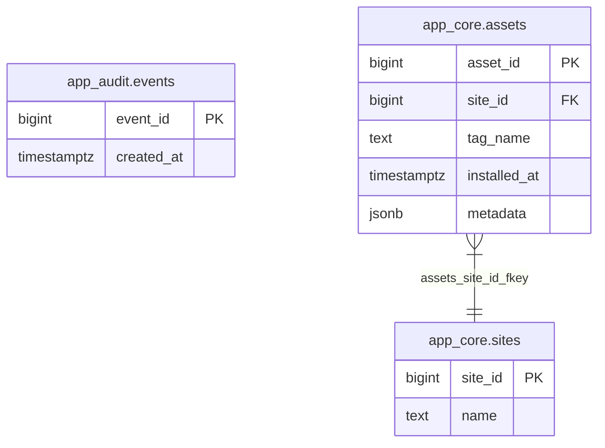

## pgllens · get_erd
*catalog · 2026-09-03T15:49:03Z*

```mermaid
erDiagram
    "app_audit.events" {
        bigint event_id PK
        timestamptz created_at
    }
    "app_core.assets" {
        bigint asset_id PK
        bigint site_id FK
        text tag_name
        timestamptz installed_at
        jsonb metadata
    }
    "app_core.sites" {
        bigint site_id PK
        text name
    }
    "app_core.assets" }|--|| "app_core.sites" : "assets_site_id_fkey"
```

---
3 tables · 1 relationship
*Next: describe_table(table="app_audit.events") · get_relationships(table="app_audit.events")*
